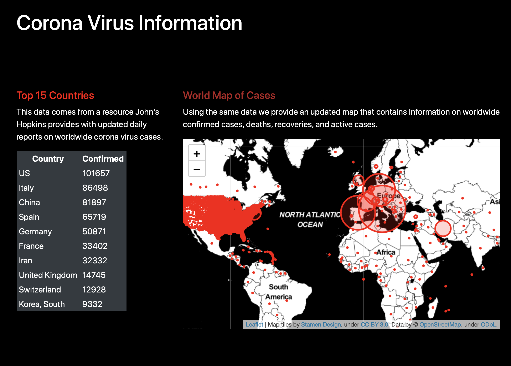

### Coronavirus Flask Application

To run this application locally, please be sure you have the `app.py` file as well as the `static` and `templates` folders in the same directory.  From your terminal in the same working directory run `python app.py` and you should have the site live at [`http://127.0.0.1:5000`](http://127.0.0.1:5000). You should see something similar to the image below if all is successful.

